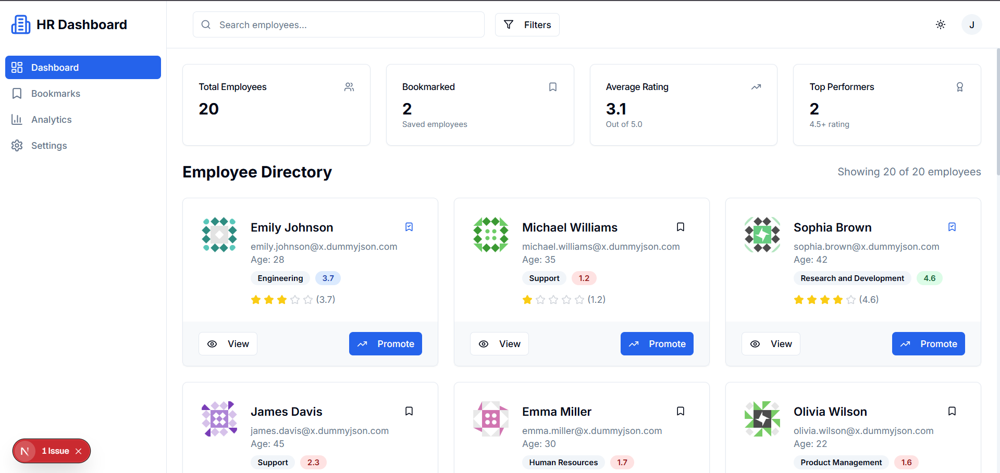
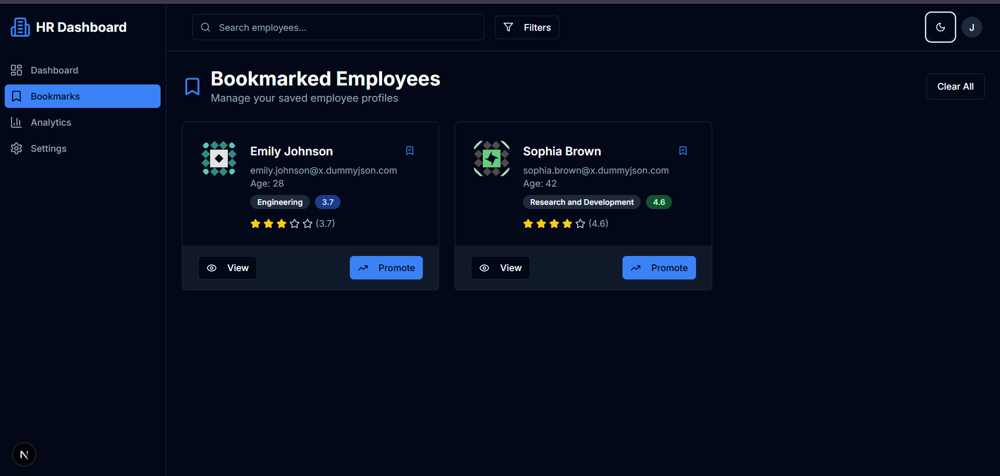
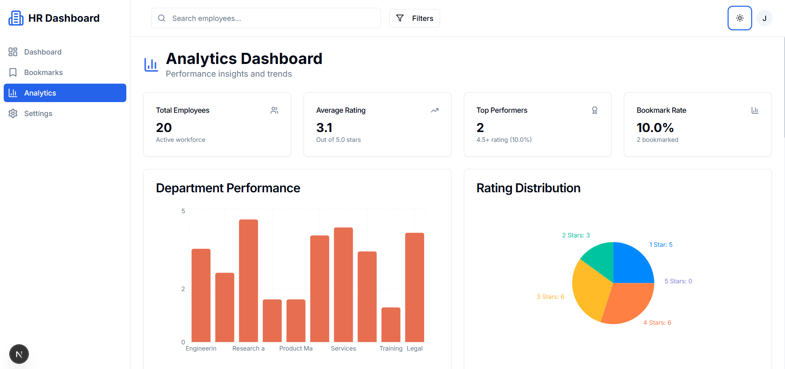
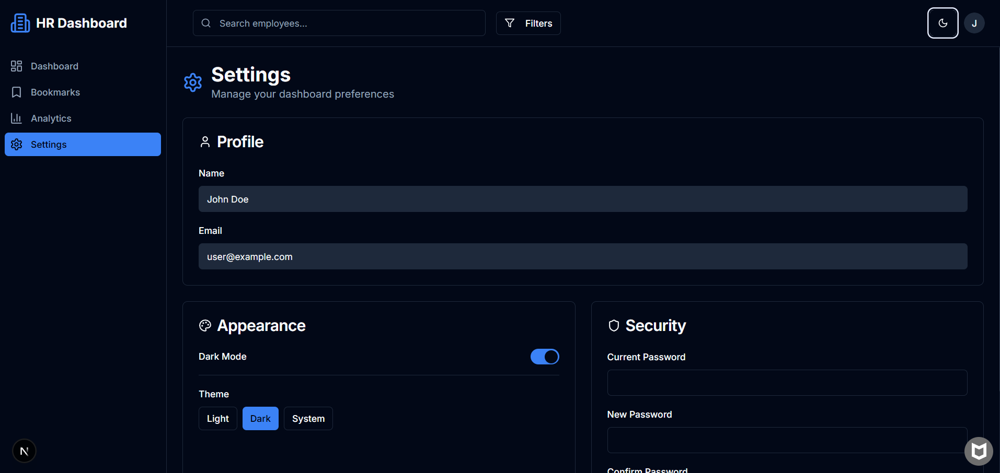
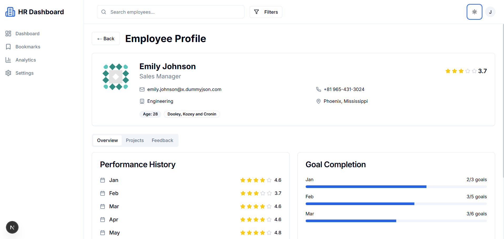
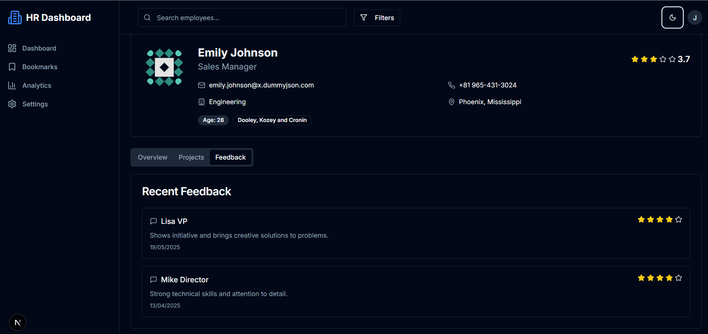

# Dashboard Homepage

A modern, responsive user management dashboard built with Next.js, React, and Tailwind CSS. This application fetches user data from an external API and provides an intuitive interface for managing team members with features like bookmarking, promotions, and performance tracking.


## 🚀 Features Implemented

### Core Features
- **User Data Fetching**: Retrieves user information from DummyJSON API (20 users)
- **Interactive User Cards**: Display comprehensive user information in card format
- **Performance Rating System**: 5-star rating display for each user
- **Real-time Statistics**: Dashboard overview with key metrics
- **State Management**: Global state using React Context API
- **Responsive Design**: Mobile-first approach with Tailwind CSS

### User Management Features
- **View User Details**: Modal popup with detailed user information
- **Bookmark Users**: Toggle bookmark status for important users
- **Promote Users**: One-click promotion system with visual feedback
- **Department Categorization**: Color-coded department badges
- **Avatar System**: Automatic initial generation with fallback images

### UI/UX Features
- **Loading States**: Skeleton loaders during data fetching
- **Error Handling**: Graceful error messages and fallback states
- **Interactive Animations**: Smooth transitions and hover effects
- **Accessibility**: ARIA labels and keyboard navigation support
- **Professional Design**: Clean, modern interface with shadcn/ui components

## 🛠️ Technologies Used

- **Frontend Framework**: Next.js 14 (App Router)
- **UI Library**: React 18
- **Styling**: Tailwind CSS
- **Component Library**: shadcn/ui
- **State Management**: React Context API + useReducer
- **Icons**: Lucide React
- **Language**: TypeScript/JavaScript (ES6+)
- **API**: DummyJSON (https://dummyjson.com)

## 📋 Prerequisites

Before running this project, make sure you have the following installed:

- **Node.js**: Version 18.0 or higher
- **npm**: Version 8.0 or higher (comes with Node.js)
- **Git**: For cloning the repository

## 🚀 Setup Instructions

### 1. Clone the Repository
```bash
git clone <repository-url>
cd dashboard-homepage
```

### 2. Install Dependencies
```bash
npm install
```

### 3. Run the Development Server
```bash
npm run dev
```

### 4. Open in Browser
Navigate to [http://localhost:3000](http://localhost:3000) to view the dashboard.

### 5. Build for Production (Optional)
```bash
npm run build
npm start
```

## 📁 Project Structure

```
dashboard-homepage/
├── app/
│   ├── globals.css          # Global styles
│   ├── layout.tsx           # Root layout with providers
│   └── page.tsx             # Main dashboard page
├── components/
│   ├── ui/                  # shadcn/ui components
│   ├── dashboard-stats.tsx  # Statistics overview component
│   ├── rating-bar.tsx       # Star rating component
│   └── user-card.tsx        # Individual user card component
├── context/
│   └── dashboard-context.tsx # Global state management
├── lib/
│   ├── mock-data.ts         # Data transformation utilities
│   └── utils.ts             # General utility functions
├── public/
│   └── placeholder.svg      # Fallback images
├── README.md
├── package.json
├── tailwind.config.ts
└── tsconfig.json
```

## 🔧 Configuration

### Environment Variables
No environment variables are required for basic functionality. The app uses public APIs.

### Tailwind Configuration
The project uses a custom Tailwind configuration with shadcn/ui integration. Colors and themes can be modified in `tailwind.config.ts`.

### API Configuration
The dashboard fetches data from:
- **Primary API**: https://dummyjson.com/users?limit=20
- **Fallback Images**: Placeholder SVGs for user avatars

## 📊 Data Structure

### User Object
```typescript
interface User {
  id: number
  firstName: string
  lastName: string
  email: string
  age: number
  department: string      // Generated: Engineering, Marketing, Sales, etc.
  rating: number         // Generated: 1-5 stars
  isBookmarked: boolean  // User interaction state
  isPromoted: boolean    // User interaction state
  image?: string         // Profile image URL
}
```

### Dashboard State
```typescript
interface DashboardState {
  users: User[]
  loading: boolean
  error: string | null
  bookmarkedUsers: number[]
  promotedUsers: number[]
}
```

## 🎯 Usage Guide

### Viewing Users
1. The dashboard automatically loads 20 users on page load
2. Each user is displayed in a card format with key information
3. Click the "View" button to see detailed user information in a modal


### Bookmarking Users
1. Click the bookmark icon on any user card
2. Bookmarked users show a filled bookmark icon
3. The dashboard stats update to reflect bookmark count
4. Click again to remove bookmark

### Promoting Users
1. Click the "Promote" button on any user card
2. Promoted users show a "Promoted" badge
3. The button becomes disabled after promotion
4. Dashboard stats update to show promotion count

### Dashboard Statistics
The top section displays real-time statistics:
- **Total Users**: Number of users loaded
- **Bookmarked**: Count of bookmarked users
- **Promoted**: Count of promoted users
- **Avg Rating**: Average performance rating across all users

## 🎨 Customization

### Adding New Departments
Edit `lib/mock-data.ts`:
```typescript
const departments = [
  "Engineering", "Marketing", "Sales", "HR", 
  "Finance", "Operations", "Design", "Support",
  "Your New Department" // Add here
]
```

### Modifying Rating System
Change the rating range in `lib/mock-data.ts`:
```typescript
export const generateMockRating = (): number => {
  return Math.floor(Math.random() * 10) + 1 // 1-10 scale
}
```

## 📝 Scripts

```bash
npm run dev          # Start development server
npm run build        # Build for production
npm run start        # Start production server
npm run lint         # Run ESLint
npm run type-check   # Run TypeScript checks
```

## 🧪 Test Login (Trial Access)

### You can log in using the following test credentials to explore the dashboard without setting up authentication:

```bash
Email:    user@example.com  
Password: password123
```
### This mock user account is configured for demo and trial purposes only. Authentication is handled using NextAuth.js with a credentials provider.

# 🖼️ Feature Previews

### 🔖 Bookmark Feature


### 📊 User Performance Analysis


### ⚙️ Settings Page


### 👥 User Management Panel


### 💬 Feedback Submission Module



## 📄 License

This project is licensed under the MIT License - see the LICENSE file for details.

## 🙏 Acknowledgments

- [DummyJSON](https://dummyjson.com) for providing the user data API
- [shadcn/ui](https://ui.shadcn.com) for the beautiful component library
- [Tailwind CSS](https://tailwindcss.com) for the utility-first CSS framework
- [Lucide](https://lucide.dev) for the icon library

---

**Built with ❤️ using Next.js and React**
```

This README provides comprehensive documentation for the dashboard project, including setup instructions, feature descriptions, troubleshooting guides, and future enhancement plans. It's structured to help both developers and users understand and work with the application effectively.


